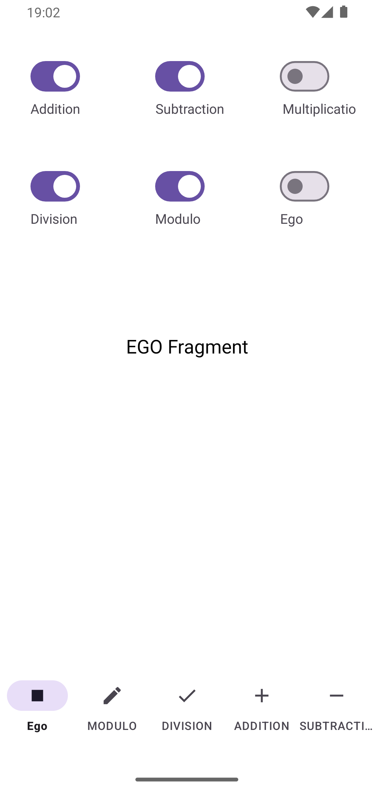
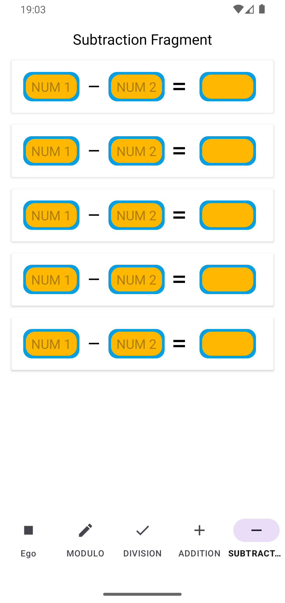

# Kekod, Switch Game

## Overview
This project is an Android application demonstrating the use of modern Android development practices including ViewModel, ActivityViewModel, Fragments, Navigation, and more. The application is structured to follow clean architecture principles and includes both unit and UI tests.

## Project Features
- **ViewModel**: 
- **ActivityViewModel**:
- **Fragment**:
- **Navigation**:
- **BottomNavigation**: 
- **Unit Tests**: 
- **UI Tests**:

## Screens

|  |  |  |
|:-----------------------------------:|:-----------------------------------:|:-----------------------------------:|
| **Screen 1**                        | **Screen 2**                        | **Screen 3**                        |

|  |  | 
|:-----------------------------------:|:-----------------------------------:|
| **Screen 4**                        | **Screen 5**                        | 

## Project Purpose

The purpose of this project is to:

- **Bottom Navigation Management:** Dynamically manage the addition and removal of items in the bottom navigation menu.
- **Clean Code Development:** Ensure code sustainability and readability by adhering to clean code principles.
- **UI Enhancements:** Add and refine user interface components to enhance the user experience.
- **Reliability Testing:** Verify the reliability and correctness of the code through unit tests and user interface (UI) tests.

